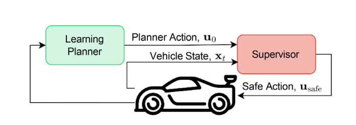
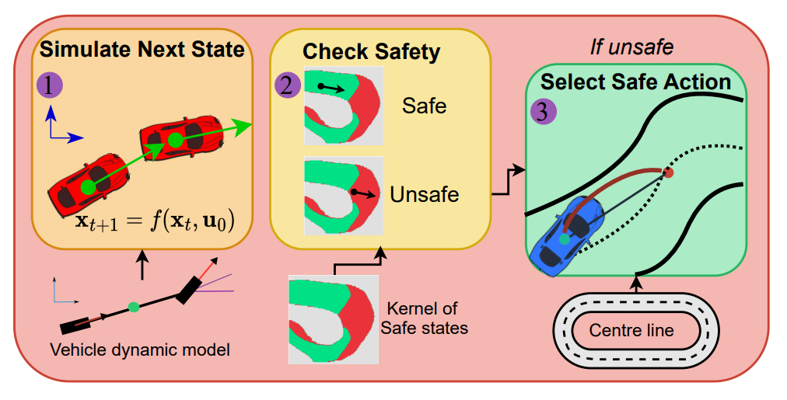
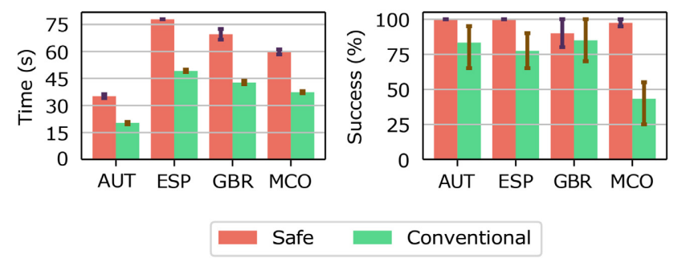

# SafeRaceLearning

This repo implements the safe reinforcement learning algorithms and tests found in ["**Safe reinforcement learning for high-speed autonomous racing**"](https://www.sciencedirect.com/science/article/pii/S2667241323000125).



Viability Theory is used to build a kernel of safe states for a track, based on the position, orientation and dynamic mode (speed and steering) of the vehicle.
The kernel is then used to evaluate if a state is safe or unsafe.
Safe states are defined as those that are recursively feasible and do not result in colliding with a boundary.



We used the safety supervisor to train end-to-end DRL agents for autonomous racing.
The advantage of training with the supervisor is that the agents never crash during training.
Training DRL agents with the supervisor results in higher completion rates on all test maps.




A limitation of our safety system is that it is overconservative, resulting in slower lap times.
This restriction is a problem for future work to address.


If you  find this work useful, please cite it,
```latex
@article{evans2023comparing,
  title={Comparing deep reinforcement learning architectures for autonomous racing},
  author={Evans, Benjamin David and Jordaan, Hendrik Willem and Engelbrecht, Herman Arnold},
  journal={Machine Learning with Applications},
  volume={14},
  pages={100496},
  year={2023},
  publisher={Elsevier}
}
```
